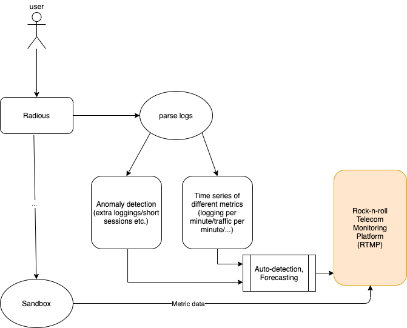
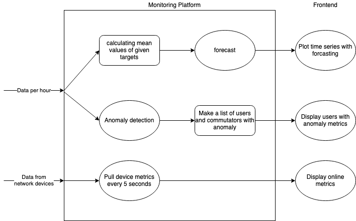

# VirusHack

## Из видео от оргов

Разработка системы анализа и прогнозирования сетевых происшествий и управленческих решений для минимизации убытков на стороне Ростелекома.

Собирает данные из нескольких инфраструктурных компонентов, анализирует их, информирует об инцидентах, строит прогноз на будущее и помогает в принятии оперативных управленческих решений.

#### Идеальное решение трека:

Cервис мониторинга и прогнозирования абонентских проблем. Дата майнинг, нейронные сети, имитационное моделирование, можно использовать любой подход и инструментарий. Важно решить проблему до того как клиенты завалят колцентр и техподержку гневными обращениями.

Прототип должен уметь работать с сетевым оборудованием, анализировать логи ПО работающего с абонентами. Из ряда событий нужно определить инциденты, оперативно сообщить о них. На основании индифицированных инцидентов составить прогноз на будущее.

#### Критерии оценки:
- кол-во оцениваемых и предсказываемых инцидентов
- подход к прогнозированию: точность модели, кол-во учитываемых факторов и тд
- кол-во реализованных фич - насколько полноценным и полным является продукт
- работоспособность прототипа, удобство развертывания сервиса

## С сайта

#### Примерный список инцидентов
+ Загрузка каналов.
+ Доступность оборудования.
+ Изменение температуры оборудования.
+ Загрузка процессора и памяти оборудования.
+ Резкое падение абонентских сессий.

#### Цель:
Уменьшение убытков от сетевых аварий. 

#### Как может работать:
составление дерева сетевых инцидентов и условий для их возникновения, анализ мониторинга сетевого оборудования, анализ состояния обслуживающего персонала.

## Structure of product

### Dataflow part



### Backend part



## Web-server (Flask)

### Run server

to run server run in root directory (port 4500):

`python backend.py`

or

`python3 backend.py`


### API documentation

#### get time series of given target with forecasting (for the last 24 hours)

#### /get_real_and_pred_data (GET)
 
##### response

```
json
{ 
"xticks" : [],
"start_stop_alige_count_" : [],
"start_stop_alige_count_Alive": [],
"start_stop_alige_count_Start": [],
"start_stop_alige_count_Stop": [],
"type__count_Billing-Accounting": [],
"type__count_Billing-Authentication": [],
"mean_delay": [],
"mean_input_trafic": [],
"mean_output_trafic": [],
"count_failed": [],
"start_stop_alige_count__pred" : [],
"start_stop_alige_count_Alive_pred": [],
"start_stop_alige_count_Start_pred": [],
"start_stop_alige_count_Stop_pred": [],
"type__count_Billing-Accounting_pred": [],
"type__count_Billing-Authentication_pred": [],
"mean_delay_pred": [],
"mean_input_trafic_pred": [],
"mean_output_trafic"_pred: [],
"count_failed_pred": []
}
```

pay attention:

xticks has size of `n` and target_pred has a size of `n`, but target has a size of `n-1` because target has all real values of time series and target_pred has a size of the history of predicted values and forecasting for the next hour


#### get time series of snmp data for the last hour

#### /get_snmp_data (GET)

##### response

```
{ 
"xticks" : [],
"temp" : [],
"mem" : [],
"cpu" : []
}
```
